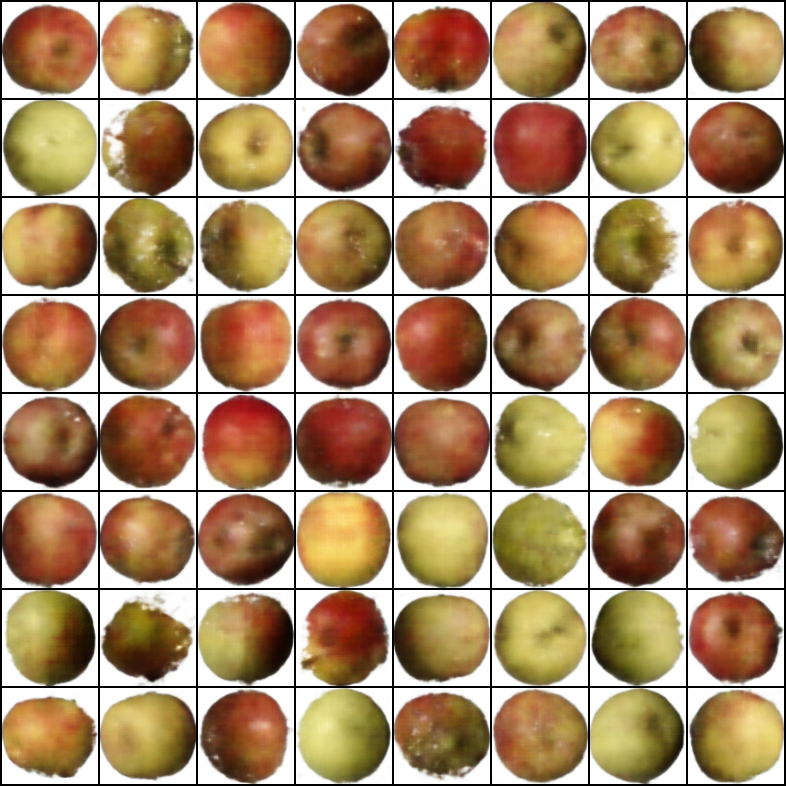
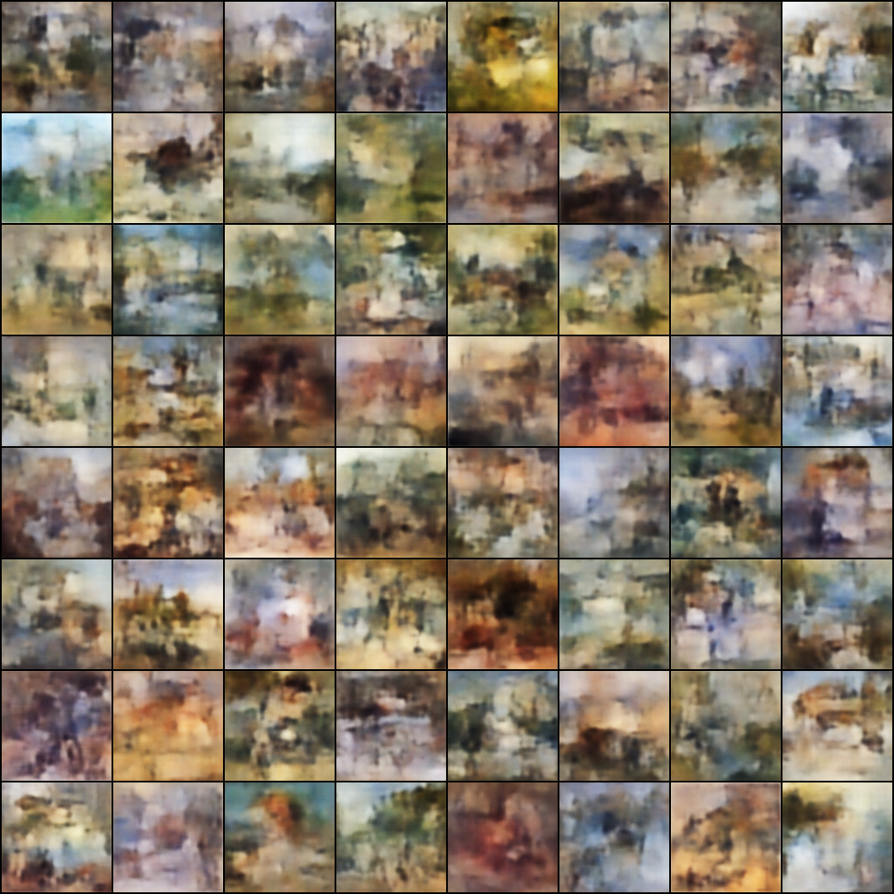

# MSAI 495 Assignment: Image Generation

This project implements a Variational Autoencoder (VAE) to learn and generate images.

## Project Structure

```text
├── best_models/ # Stores best-performing model checkpoints (e.g., lowest FID)
├── config/ # YAML config files
├── data_apples/ # Apple Dataset root folder 
├── data_impressionism/ # Apple Dataset root folder 
├── logs/ # Training logs and checkpoints 
├── run_vae.py # VAE model architecture
├── tune_vae.py # Ray Tune
├── ui.py # interactive Streamlit UI
├── README.md 
└── environment.yml # Conda environment specification 
```

## Datasets

This project utilizes two datasets:

### 1. WikiArt Impressionism Subset

- A dataset focused on Impressionism style paintings from [WikiArt](https://www.kaggle.com/datasets/steubk/wikiart).
- Categorized into 4 visual genres:
  - `landscape` : 3079
  - `genre_painting` : 2669
  - `portrait` : 1899
  - `cityscape` : 1545

### 2. Fruit360 Apple Subset

- A simpler dataset composed of Apple class images from [Fruit360](https://www.kaggle.com/datasets/moltean/fruits).
- Used as a **control experiment** to validate basic image generation capability of the model.
- This subset includes 3 apple categories:
  - `Golden` : 1938
  - `Golden-Red` : 1647
  - `Red` : 1885
- Download from Google Drive: [Dataset Link](https://drive.google.com/file/d/1PReXv2oG5IiErLhXRoru0oJIF25RCYS8/view?usp=drive_link)

> **Why two datasets?**  
> During implementation, I found that paintings require much finer detail and structure to generate realistic results. In contrast, , Fruit360 is simpler and more structured. It allows the model’s performance to be shown more directly.

## Getting Started

### 1. Installation

```bash
conda env create -f environment.yml
conda activate genai
```

### 2. Train

```bash
python run_vae.py --config ./config/train_apples
```

### 3. Test

```bash
python run_vae.py --config ./config/test_apples
```

To visually explore the generated samples, you can launch the interactive Streamlit UI:

```bash
streamlit run ui.py
```

## Model Architecture

| Part    | Layer(s)                                                                                                                                          | Notes                                                                                                      |
|---------|---------------------------------------------------------------------------------------------------------------------------------------------------|------------------------------------------------------------------------------------------------------------|
| Encoder | **Input 3 × H × W** → Conv2d (3 → 64, 4×4, stride 2, pad 1) → ReLU → Conv2d (64 → 128, 4×4, s2) → BatchNorm → ReLU → Conv2d (128 → 256, 4×4, s2) → BatchNorm → ReLU → Conv2d (256 → 512, 4×4, s2) → BatchNorm → ReLU → Flatten → **FC → μ**, **FC → log σ²** | If `--conditional`, the one‑hot label (**c**) is broadcast on channels and concatenated with **x** before the first conv. |
| Latent  | **z = μ + σ ⊙ ε**, with ε ~ 𝒩(0, I)                                                                                                               | Default `latent_dim = 128`; sweeps such as {64, 128, 256} supported.                                       |
| Decoder | **z (± c)** → FC → reshape to 512 × (H/16) × (W/16) → ConvT (512 → 256, 4×4, s2) → BatchNorm → ReLU → ConvT (256 → 128, 4×4, s2) → BatchNorm → ReLU → ConvT (128 → 64, 4×4, s2) → BatchNorm → ReLU → ConvT (64 → 3, 4×4, s2) → Sigmoid | Outputs RGB in **[0, 1]**; if conditional, **c** is concatenated with **z** at the FC input.               |
| Loss    | **ℒ = MSE(x, x̂) + β · KL(𝒩(μ, σ²)‖𝒩(0, I))**                                                                                                    | `β` linearly warms up over `--beta_warmup` epochs and can cycle every `--beta_cycle` epochs.               |

## Extra Project Criteria

### 1. Metrics Training & Evaluation Tracking

- Utilized **TensorBoard** (`SummaryWriter`) to log key training metrics such as loss and KL divergence.
- Employed **Weights & Biases (wandb)** to track all relevant metrics, including loss, KL, FID, and β throughout training.
- Implemented a custom `evaluate_fid()` function that periodically computes **FID** during training and saves the best-performing model based on this metric.

### 2. Hyperparameter Tuning Strategies

- Adopted **Ray Tune with OptunaSearch** for systematic hyperparameter optimization, exploring key parameters such as learning rate, latent dimension, β, β warm-up duration, and batch size.
- Investigated **β scheduling strategies**, including **KL annealing** and **cyclic β**, controlled via --beta_warmup and --beta_cycle arguments.
- Each trial automatically logs metrics and preserves configuration for reproducibility.

### 3. Gallery GUI

- Enabled reconstruction-based image generation via random sampling from the latent prior z ~ N(0, I), supporting **conditional inputs** y for CVAE models.
- Implemented generation under both **conditional and unconditional settings**, using **one-hot label embeddings** for multi-class controllable generation.

### 4. Gallery GUI

Built an interactive GUI with Streamlit (`ui.py`) to visually explore generated images, allowing users to configure model paths and visualize outputs in real time.

## Results Overview

### Apples Dataset

The model performs well on the **Fruit360 Apples subset**, successfully generating images that resemble **three distinct apple varieties**. The outputs show clear structure, smooth surfaces, and appropriate color variation, indicating that the VAE has effectively learned the data distribution.

**Generated Samples:**

<!--  -->


### Impressionism Paintings (WikiArt)

On the **Impressionism subset of WikiArt**, results are **visually aligned with stylistic features**—such as **loose brushstrokes** and **vibrant colors**—but lack semantic clarity in depicting concrete scenes or objects. This suggests that the current model captures texture but not complex spatial composition.

**Generated Samples:**

<!--  -->


#### Potential Future Improvements

- **Perceptual reconstruction losses**  
  Replace pixel-wise MSE with VGG-perceptual loss or LPIPS to preserve texture.  
  → Loss format: `L_total = λ_pix * MSE + λ_perc * L_VGG + β * KL`.

- **Hierarchical / multi-scale latents**  
  Capture global color and fine texture separately with a Ladder VAE or VDVAE.  
  → Upper latents model color wash, lower latents refine strokes.

- **Brush-stroke inductive biases**  
  Default CNNs may miss stroke orientation.  
  → Try Gabor filters, directional kernels, or Vision Transformer decoders.

- **Better priors & posteriors**  
  Move beyond factorized Gaussian assumptions.  
  → Use flow-based posteriors (IAF, Real-NVP) or switch to VQ-VAE-2 for sharper images.

- **Adversarial or diffusion refinements**  
  Boost high-frequency details while keeping β-VAE semantics.  
  → Add a patch-based GAN head or feed VAE output into a diffusion upsampler.
